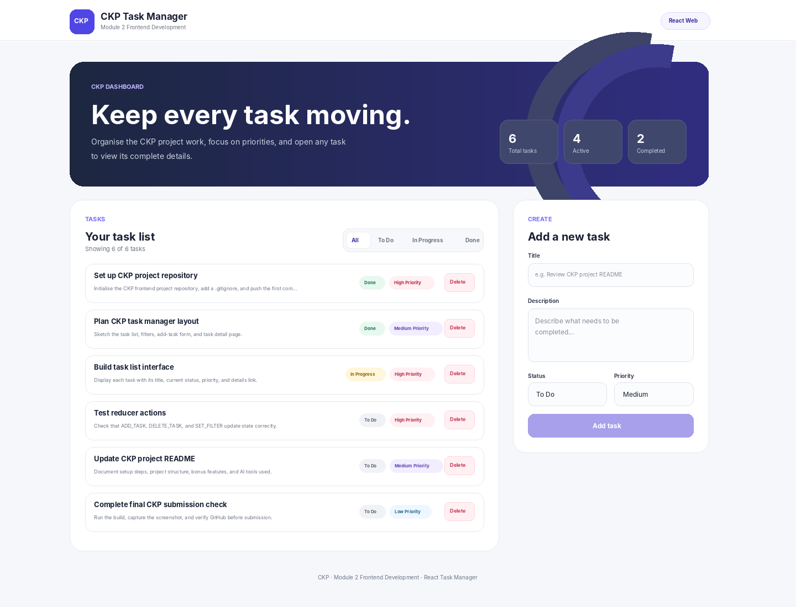

# CKP Task Manager

A React web application for viewing, adding, deleting, filtering, and inspecting tasks. I prepared this project for the **Module 2: Frontend Development (React Web)** assignment and customised the task content and interface with my **CKP** project label.



## Features

- Displays six seeded tasks with title, status, and priority
- Filters tasks by **All**, **To Do**, **In Progress**, and **Done**
- Adds new tasks using a controlled React form
- Deletes tasks directly from the task list
- Opens a task detail route at `/tasks/:id`
- Shows **Task not found** when an invalid or deleted task ID is used
- Redirects `/` and unknown routes to `/tasks`

### Bonus features completed

- Task count summary: `Showing X of Y tasks`
- Disabled Add Task button until the required text fields are completed
- `localStorage` persistence so tasks survive a browser refresh
- Responsive layout for desktop and smaller screens

## Technology used

- React
- Vite
- React Router
- Context API
- `useReducer`
- Browser `localStorage`
- Plain CSS

## Project structure

```text
task-manager/
├── screenshots/
│   └── task-manager-main.png
├── src/
│   ├── components/
│   │   ├── AddTaskForm.jsx
│   │   ├── FilterBar.jsx
│   │   ├── Header.jsx
│   │   ├── TaskItem.jsx
│   │   └── TaskList.jsx
│   ├── context/
│   │   └── TaskContext.jsx
│   ├── pages/
│   │   ├── TaskDetailPage.jsx
│   │   └── TaskListPage.jsx
│   ├── reducer/
│   │   └── taskReducer.js
│   ├── App.jsx
│   ├── index.css
│   └── main.jsx
├── .gitignore
├── index.html
├── package.json
├── README.md
└── vite.config.js
```

## Installation and running the project

### 1. Open the project in VS Code

Open the extracted `task-manager` folder in Visual Studio Code.

### 2. Open a terminal

In VS Code, select **Terminal → New Terminal**.

### 3. Install dependencies

```bash
npm install
```

### 4. Start the development server

```bash
npm run dev
```

Open the local URL shown in the terminal, normally:

```text
http://localhost:5173
```

### 5. Create a production build

```bash
npm run build
```

## How the required concepts are implemented

### Reducer

`src/reducer/taskReducer.js` contains `taskReducer` and handles:

- `ADD_TASK`
- `DELETE_TASK`
- `SET_FILTER`

The same file also contains the six CKP seed tasks and the initial `filter: 'all'` state.

### Context

`src/context/TaskContext.jsx` uses `useReducer` and provides:

- `tasks`
- `filteredTasks`
- `filter`
- `addTask`
- `deleteTask`
- `setFilter`

`filteredTasks` is calculated during render rather than being stored separately in state. The task array is also saved to `localStorage` using the key `ckp-task-manager-tasks`.

### Routing

`src/App.jsx` defines these routes:

| Route | Purpose |
|---|---|
| `/tasks` | Task list, filters, and Add Task form |
| `/tasks/:id` | Individual task detail page |
| `/` | Redirects to `/tasks` |

The Header and CKP footer remain visible across the application pages.

## Manual testing checklist

1. Confirm the six CKP seed tasks appear on a fresh launch.
2. Select each status filter and verify the visible tasks change.
3. Add a task and confirm the form resets.
4. Reload the browser and confirm the new task remains.
5. Open a task and confirm all task fields appear on the detail page.
6. Return to the list and delete a task.
7. Visit `/tasks/99999` and confirm the **Task not found** message appears.
8. Run `npm run build` and confirm the build completes successfully.

### Resetting the seed tasks during testing

Because the bonus version uses `localStorage`, previously saved tasks take priority over the seed data. To reset the browser back to the current CKP seed tasks, open the browser console and run:

```js
localStorage.removeItem('ckp-task-manager-tasks')
```

Then refresh the page.

## GitHub submission steps

```bash
git init
git add .
git commit -m "Complete CKP React task manager assignment"
git branch -M main
git remote add origin https://github.com/YOUR-USERNAME/task-manager.git
git push -u origin main
```

Replace `YOUR-USERNAME` with the GitHub username used for the submission repository.

## AI and external-source declaration

ChatGPT was used to help interpret the assignment requirements, suggest the React component structure, assist with debugging, and review the code and interface. The project was further customised with CKP naming and course-related task content. No external source code was copied directly into this project.
